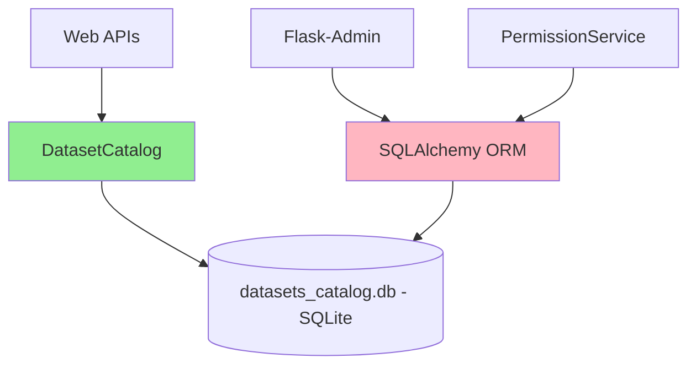
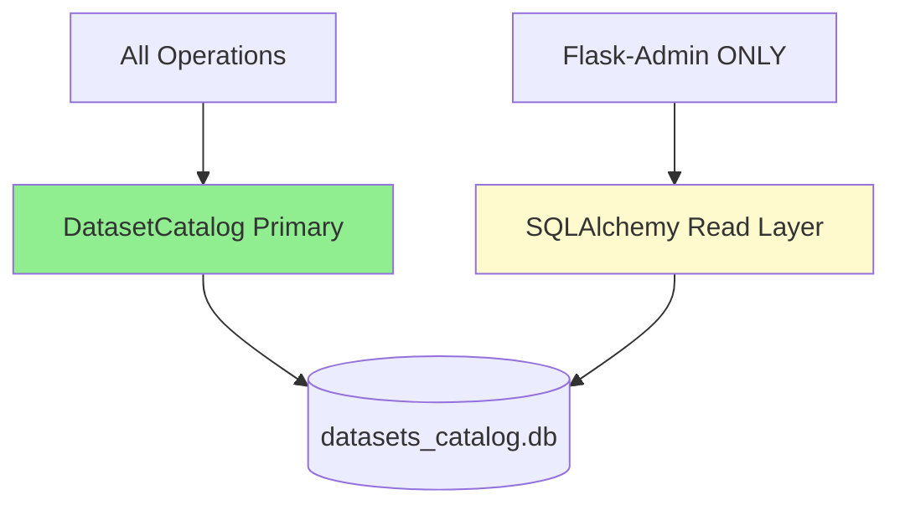

# Design Log 12 — Dataset Source-of-Truth Migration Plan

## Executive Summary

**Current State:** Dual storage layer with DatasetCatalog (SQLite raw access) handling 99% of operations and SQLAlchemy Dataset ORM model used only for Flask-Admin and PermissionService (11 occurrences).

**Target State:** Unified storage through **DatasetCatalog as primary source-of-truth**, with SQLAlchemy ORM as optional admin-only layer.

**Rationale:** 
- DatasetCatalog already handles all API, search, download, indexing, and metadata operations
- 180 datasets exist in catalog, actively used by 40+ endpoints
- SQLAlchemy only used in 2 files (services/__init__.py, admin_views.py)
- Current ownership split: `owner_username` (catalog) vs `owner_id` (ORM) creates semantic drift

---

## Background

### Current Architecture



**DatasetCatalog** (`src/dataset_catalog.py`, 762 lines):
- Direct SQLite3 connection and cursor
- Full-text search (FTS5)
- Metadata extraction from CSV files
- Column-level statistics
- Used by: CLI, all web APIs, search, download, indexing, RAG, recommender

**SQLAlchemy Dataset Model** (`src/models.py`):
- ORM-based with relationships (User, UserDatasetAccess, DatasetColumn)
- RBAC methods (`can_access`, `share_with`, `revoke_access`)
- Used by: Flask-Admin (admin_views.py), PermissionService (services/__init__.py)

### Data Ownership Evidence

```bash
# datasets_catalog.db ownership state:
owner_id | owner_username | count
---------|----------------|------
None     | None           | 25    # Legacy datasets
None     | fsanmartin     | 6     # Username-only
1        | None           | 149   # User ID-only
```

**Issue:** Schema has BOTH `owner_id` and `owner_username` but inconsistent population.

---

## Problem Statement

### Critical Issues

1. **Semantic Drift:** Catalog uses `owner_username` (string), ORM uses `owner_id` (int FK)
2. **Data Desync:** ORM changes don't propagate to catalog (e.g., admin edits)
3. **Maintenance Burden:** Two write paths, two query patterns, two ownership models
4. **Test Coverage Gap:** No tests verify ORM ↔ Catalog consistency

### Usage Analysis

**DatasetCatalog Usage (dominant):**
- 40+ API endpoints (datasets.py, search.py, download.py, analysis.py, compare.py, data_formulator.py)
- 13 copilot_tools.py functions
- CLI operations (src/cli.py)
- RAG indexing (src/rag/index.py)
- Pipeline automation (src/pipeline.py)

**SQLAlchemy ORM Usage (minimal):**
- Flask-Admin views (8 references in admin_views.py)
- PermissionService RBAC checks (services/__init__.py)

---

## Target Architecture

### Option A: DatasetCatalog as Source-of-Truth ✅ RECOMMENDED

**Rationale:**
- Already handles 99% of operations
- Optimized for dataset-centric workflows (FTS5, metadata extraction)
- Lower impedance for CSV → metadata workflows
- Simpler ownership model (username-based)

**Migration Strategy:**



**Changes Required:**
1. Remove SQLAlchemy write operations from PermissionService
2. Add RBAC methods to DatasetCatalog
3. Make Flask-Admin read-only OR sync ORM writes back to catalog
4. Standardize on `owner_username` (sanitized) as primary ownership key

---

### Option B: SQLAlchemy ORM as Source-of-Truth ❌ NOT RECOMMENDED

**Why not:**
- Requires rewriting 40+ endpoints and 13 copilot tools
- Breaks CLI workflows (no Flask context)
- ORM overhead for simple CSV indexing operations
- Existing FTS5 optimizations tied to catalog

---

## Phased Migration Plan

### Phase 1: Analysis & Preparation (2-4 hours)

**1.1 Audit Ownership Data**
```bash
# Run ownership audit script
python3 scripts/audit_dataset_ownership.py > ownership_report.txt
```

**1.2 Identify ORM Write Operations**
```bash
grep -rn "db.session.add\|db.session.commit" src/ --include="*.py" | grep -i dataset
```

**1.3 Document Current RBAC Logic**
- Extract PermissionService logic to standalone functions
- Map ORM relationships (UserDatasetAccess, User)

**Deliverable:** `MIGRATION_AUDIT_REPORT.md` with:
- All ORM write operations
- Ownership data inconsistencies
- RBAC dependencies

---

### Phase 2: Extend DatasetCatalog (4-6 hours)

**2.1 Add RBAC Methods to DatasetCatalog**

```python
# src/dataset_catalog.py additions

def can_access(self, dataset_id: int, username: str, min_level: str = 'read') -> bool:
    """Check if user can access dataset with minimum permission level."""
    conn = sqlite3.connect(self.db_path)
    cursor = conn.cursor()
    
    # Get dataset owner
    cursor.execute("SELECT owner_username, is_public FROM datasets WHERE id = ?", (dataset_id,))
    result = cursor.fetchone()
    if not result:
        return False
    
    owner_username, is_public = result
    sanitized_username = sanitize_username(username)
    
    # Owner check
    if owner_username == sanitized_username:
        return True
    
    # Public read check
    if is_public and min_level == 'read':
        return True
    
    # Check user_dataset_access table
    cursor.execute("""
        SELECT uda.access_level FROM user_dataset_access uda
        JOIN users u ON uda.user_id = u.id
        WHERE uda.dataset_id = ? AND u.username = ?
    """, (dataset_id, username))
    access = cursor.fetchone()
    conn.close()
    
    if not access:
        return False
    
    levels = {'read': 1, 'write': 2, 'admin': 3}
    return levels.get(access[0], 0) >= levels.get(min_level, 1)

def grant_access(self, dataset_id: int, granter_username: str, 
                 target_username: str, access_level: str = 'read') -> bool:
    """Grant dataset access. Only owner or admin can grant."""
    if not self.can_access(dataset_id, granter_username, 'admin'):
        return False
    
    conn = sqlite3.connect(self.db_path)
    cursor = conn.cursor()
    
    # Get user IDs
    cursor.execute("SELECT id FROM users WHERE username = ?", (target_username,))
    user_id = cursor.fetchone()
    if not user_id:
        conn.close()
        return False
    
    # Insert or update access
    cursor.execute("""
        INSERT INTO user_dataset_access (user_id, dataset_id, access_level, granted_at)
        VALUES (?, ?, ?, CURRENT_TIMESTAMP)
        ON CONFLICT(user_id, dataset_id) DO UPDATE SET access_level = ?, granted_at = CURRENT_TIMESTAMP
    """, (user_id[0], dataset_id, access_level, access_level))
    
    # Mark dataset as shared
    cursor.execute("UPDATE datasets SET is_shared = 1 WHERE id = ?", (dataset_id,))
    conn.commit()
    conn.close()
    return True

def revoke_access(self, dataset_id: int, revoker_username: str, target_username: str) -> bool:
    """Revoke dataset access."""
    if not self.can_access(dataset_id, revoker_username, 'admin'):
        return False
    
    conn = sqlite3.connect(self.db_path)
    cursor = conn.cursor()
    
    cursor.execute("""
        DELETE FROM user_dataset_access 
        WHERE dataset_id = ? AND user_id = (SELECT id FROM users WHERE username = ?)
    """, (dataset_id, target_username))
    
    # Check if still shared
    cursor.execute("SELECT COUNT(*) FROM user_dataset_access WHERE dataset_id = ?", (dataset_id,))
    count = cursor.fetchone()[0]
    if count == 0:
        cursor.execute("UPDATE datasets SET is_shared = 0 WHERE id = ?", (dataset_id,))
    
    conn.commit()
    conn.close()
    return True
```

**2.2 Add Ownership Normalization**

```python
def normalize_ownership(self, force: bool = False) -> dict:
    """Normalize ownership data: owner_id → owner_username."""
    conn = sqlite3.connect(self.db_path)
    cursor = conn.cursor()
    
    # Get datasets with owner_id but no owner_username
    cursor.execute("""
        SELECT d.id, d.owner_id, u.username
        FROM datasets d
        LEFT JOIN users u ON d.owner_id = u.id
        WHERE d.owner_id IS NOT NULL AND (d.owner_username IS NULL OR ? = 1)
    """, (force,))
    
    updates = []
    for dataset_id, owner_id, username in cursor.fetchall():
        if username:
            sanitized = sanitize_username(username)
            cursor.execute("UPDATE datasets SET owner_username = ? WHERE id = ?", 
                          (sanitized, dataset_id))
            updates.append((dataset_id, username, sanitized))
    
    conn.commit()
    conn.close()
    
    return {'updated': len(updates), 'details': updates}
```

**2.3 Add Bulk Update Method**

```python
def update_dataset_metadata(self, dataset_id: int, updates: dict, username: str) -> bool:
    """Update dataset metadata with ownership check."""
    if not self.can_access(dataset_id, username, 'write'):
        return False
    
    conn = sqlite3.connect(self.db_path)
    cursor = conn.cursor()
    
    allowed_fields = ['indicator_name', 'description', 'topic', 'is_public', 'is_shared']
    set_clause = ', '.join(f"{k} = ?" for k in updates.keys() if k in allowed_fields)
    values = [v for k, v in updates.items() if k in allowed_fields]
    values.append(dataset_id)
    
    cursor.execute(f"UPDATE datasets SET {set_clause} WHERE id = ?", values)
    conn.commit()
    conn.close()
    return True
```

---

### Phase 3: Deprecate ORM Writes (3-5 hours)

**3.1 Refactor PermissionService**

```python
# src/services/__init__.py - BEFORE
class PermissionService:
    @staticmethod
    def can_read(user_id: int, dataset_id: int) -> bool:
        dataset = Dataset.query.get(dataset_id)
        if not dataset:
            return False
        return dataset.can_access(user_id, 'read')
```

```python
# src/services/__init__.py - AFTER
from src.dataset_catalog import DatasetCatalog
from src.config import Config

class PermissionService:
    @staticmethod
    def can_read(user_id: int, dataset_id: int) -> bool:
        from src.models import User
        user = User.query.get(user_id)
        if not user:
            return False
        
        config = Config()
        catalog = DatasetCatalog(config)
        return catalog.can_access(dataset_id, user.username, 'read')
    
    # Similar for can_write, can_admin, grant_access, revoke_access
```

**3.2 Update Admin Views**

Option A: Make Flask-Admin read-only
```python
# src/admin_views.py
class DatasetAdminView(ModelView):
    can_create = False  # Disable creation
    can_edit = False    # Disable editing
    can_delete = False  # Disable deletion
    
    # Add custom actions using DatasetCatalog
    @action('make_public', 'Make Public', 'Make selected datasets public?')
    def action_make_public(self, ids):
        config = Config()
        catalog = DatasetCatalog(config)
        for dataset_id in ids:
            catalog.update_dataset_metadata(
                dataset_id, 
                {'is_public': True}, 
                current_user.username
            )
        flash(f'{len(ids)} datasets made public.', 'success')
```

Option B: Sync ORM writes to catalog
```python
# Add after_update listener in models.py
@event.listens_for(Dataset, 'after_update')
def sync_dataset_to_catalog(mapper, connection, target):
    """Sync ORM updates to catalog."""
    config = Config()
    catalog = DatasetCatalog(config)
    catalog.update_dataset_metadata(
        target.id,
        {
            'indicator_name': target.indicator_name,
            'description': target.description,
            'topic': target.topic,
            'is_public': target.is_public,
            'is_shared': target.is_shared
        },
        target.owner.username
    )
```

---

### Phase 4: Schema Consolidation (2-3 hours)

**4.1 Run Ownership Normalization**

```bash
python3 -c "
from src.config import Config
from src.dataset_catalog import DatasetCatalog

config = Config()
catalog = DatasetCatalog(config)
result = catalog.normalize_ownership(force=True)
print(f'Normalized {result[\"updated\"]} datasets')
"
```

**4.2 Add Schema Validation**

```sql
-- Ensure owner_username is populated
UPDATE datasets 
SET owner_username = 'unknown' 
WHERE owner_username IS NULL;

-- Add NOT NULL constraint (future migration)
-- ALTER TABLE datasets MODIFY COLUMN owner_username TEXT NOT NULL;
```

**4.3 Deprecate owner_id Column (Optional)**

```python
# DO NOT remove immediately - keep for rollback capability
# Mark as deprecated in schema documentation
```

---

### Phase 5: Testing & Verification (3-4 hours)

**5.1 Create Verification Script**

```python
# scripts/verify_migration.py

import sqlite3
from src.config import Config
from src.dataset_catalog import DatasetCatalog
from src.models import Dataset, db, User

def verify_ownership_consistency():
    """Verify ownership data is consistent."""
    config = Config()
    catalog = DatasetCatalog(config)
    
    conn = sqlite3.connect(catalog.db_path)
    cursor = conn.cursor()
    
    issues = []
    
    # Check 1: All datasets have owner_username
    cursor.execute("SELECT COUNT(*) FROM datasets WHERE owner_username IS NULL")
    null_owners = cursor.fetchone()[0]
    if null_owners > 0:
        issues.append(f"{null_owners} datasets missing owner_username")
    
    # Check 2: ORM and catalog match
    orm_datasets = Dataset.query.all()
    for ds in orm_datasets:
        cursor.execute("SELECT owner_username FROM datasets WHERE id = ?", (ds.id,))
        row = cursor.fetchone()
        if row and row[0]:
            expected = sanitize_username(ds.owner.username) if ds.owner else None
            if row[0] != expected:
                issues.append(f"Dataset {ds.id}: ORM owner={expected}, Catalog owner={row[0]}")
    
    conn.close()
    return issues

def verify_rbac_parity():
    """Verify RBAC checks work via catalog."""
    config = Config()
    catalog = DatasetCatalog(config)
    
    # Test with known user/dataset
    user = User.query.first()
    dataset = Dataset.query.filter_by(owner_id=user.id).first()
    
    if user and dataset:
        # Should match
        orm_result = dataset.can_access(user.id, 'read')
        catalog_result = catalog.can_access(dataset.id, user.username, 'read')
        
        if orm_result != catalog_result:
            return [f"RBAC mismatch: ORM={orm_result}, Catalog={catalog_result}"]
    
    return []

if __name__ == "__main__":
    print("=== Migration Verification ===\n")
    
    ownership_issues = verify_ownership_consistency()
    print(f"Ownership Issues: {len(ownership_issues)}")
    for issue in ownership_issues[:10]:
        print(f"  - {issue}")
    
    rbac_issues = verify_rbac_parity()
    print(f"\nRBAC Issues: {len(rbac_issues)}")
    for issue in rbac_issues:
        print(f"  - {issue}")
    
    if not ownership_issues and not rbac_issues:
        print("\n✅ All checks passed!")
    else:
        print(f"\n❌ Found {len(ownership_issues) + len(rbac_issues)} issues")
```

**5.2 Unit Tests**

```python
# tests/test_catalog_rbac.py

import pytest
from src.dataset_catalog import DatasetCatalog
from src.config import Config
from src.models import User, Dataset, db

def test_can_access_owner(catalog, test_user, test_dataset):
    """Owner should always have access."""
    assert catalog.can_access(test_dataset.id, test_user.username, 'read')
    assert catalog.can_access(test_dataset.id, test_user.username, 'write')
    assert catalog.can_access(test_dataset.id, test_user.username, 'admin')

def test_can_access_public_read(catalog, test_dataset, other_user):
    """Public dataset should be readable by anyone."""
    # Make public
    catalog.update_dataset_metadata(test_dataset.id, {'is_public': True}, test_dataset.owner.username)
    
    assert catalog.can_access(test_dataset.id, other_user.username, 'read')
    assert not catalog.can_access(test_dataset.id, other_user.username, 'write')

def test_grant_revoke_access(catalog, test_dataset, other_user):
    """Grant and revoke should work."""
    owner = test_dataset.owner
    
    # Grant
    assert catalog.grant_access(test_dataset.id, owner.username, other_user.username, 'write')
    assert catalog.can_access(test_dataset.id, other_user.username, 'write')
    
    # Revoke
    assert catalog.revoke_access(test_dataset.id, owner.username, other_user.username)
    assert not catalog.can_access(test_dataset.id, other_user.username, 'read')

def test_unauthorized_grant_fails(catalog, test_dataset, other_user):
    """Non-owner cannot grant access."""
    another_user = User(username='third', email='third@test.com')
    db.session.add(another_user)
    db.session.commit()
    
    assert not catalog.grant_access(test_dataset.id, other_user.username, another_user.username, 'read')
```

**5.3 Integration Tests**

```python
# tests/test_migration_integration.py

def test_admin_view_sync(client, admin_user):
    """Admin changes should reflect in catalog."""
    # Create dataset via catalog
    # Edit via Flask-Admin
    # Verify changes in catalog
    pass

def test_api_rbac_enforcement(client, test_user, test_dataset):
    """API endpoints should respect RBAC."""
    # Test /api/datasets/{id} with different users
    # Test /api/datasets/{id}/delete with non-owner
    pass
```

---

### Phase 6: Documentation & Cleanup (2-3 hours)

**6.1 Update Documentation**

```markdown
# docs/ARCHITECTURE.md additions

## Dataset Storage Layer

**Primary Source-of-Truth:** DatasetCatalog (`src/dataset_catalog.py`)

All dataset operations flow through DatasetCatalog:
- CRUD operations
- Metadata indexing
- Full-text search
- RBAC enforcement
- Ownership tracking (username-based)

**SQLAlchemy ORM:** Admin-only read layer for Flask-Admin views.

**Ownership Model:** 
- Primary key: `owner_username` (sanitized username string)
- Legacy key: `owner_id` (integer FK, deprecated but retained for rollback)
```

**6.2 Add Migration Notes to Design Log**

Update this file with implementation results (see template below).

**6.3 Remove Dead Code**

```bash
# After successful migration and testing
# Remove unused ORM methods (mark as deprecated first)
```

---

## Compatibility Strategy

### Backward Compatibility

**Level 1: API Compatibility (MUST preserve)**
- All `/api/datasets/*` endpoints unchanged
- Query parameters unchanged
- Response formats unchanged

**Level 2: Database Compatibility (MUST preserve)**
- Existing datasets remain accessible
- Schema additive-only (no column drops in Phase 1-5)
- Both `owner_id` and `owner_username` populated during migration

**Level 3: Admin Interface (MAY break)**
- Flask-Admin may become read-only temporarily
- RBAC workflows tested separately

### Migration Safety

**Zero Downtime Approach:**
1. Add new methods to DatasetCatalog (no breaking changes)
2. Dual-write to both `owner_id` and `owner_username`
3. Gradually migrate consumers
4. Deprecate ORM writes
5. Monitor for 1 week
6. Remove dead code

**Data Integrity:**
- No DELETE operations on datasets table
- All updates are additive
- Ownership normalization is idempotent
- Rollback script provided (see below)

---

## Rollback Plan

### Immediate Rollback (during Phase 2-3)

**If:** New RBAC methods fail tests

**Action:**
```bash
git revert <migration-commit>
# No data changes yet, safe to revert code
```

### Data Rollback (during Phase 4-5)

**If:** Ownership normalization introduces bugs

**Action:**
```python
# scripts/rollback_ownership.py

import sqlite3
from src.config import Config

config = Config()
db_path = config.data_root / 'datasets_catalog.db'

conn = sqlite3.connect(db_path)
cursor = conn.cursor()

# Restore from owner_id
cursor.execute("""
    UPDATE datasets 
    SET owner_username = (SELECT username FROM users WHERE users.id = datasets.owner_id)
    WHERE owner_id IS NOT NULL
""")

conn.commit()
conn.close()
print("Rollback complete: owner_username restored from owner_id")
```

### Full Rollback (Phase 6+)

**If:** Major issues discovered after deployment

**Requires:**
1. Database backup from pre-migration
2. Git revert to pre-migration commit
3. Restore `datasets_catalog.db` from backup

**Restore Commands:**
```bash
# Stop web service
systemctl stop data-curator

# Restore database
cp datasets_catalog.db.backup datasets_catalog.db

# Revert code
git checkout <pre-migration-commit>
pip install -r requirements.txt

# Restart service
systemctl start data-curator
```

---

## Risk Assessment

### High Risk 🔴

**Risk:** Ownership data corruption during normalization
- **Mitigation:** Backup database before Phase 4
- **Detection:** Verification script in Phase 5
- **Recovery:** Rollback script provided

**Risk:** RBAC bypass allowing unauthorized access
- **Mitigation:** Comprehensive RBAC tests in Phase 5
- **Detection:** Security audit post-migration
- **Recovery:** Emergency rollback + security patch

### Medium Risk 🟡

**Risk:** Flask-Admin breaks after ORM write deprecation
- **Mitigation:** Read-only mode OR sync listener
- **Detection:** Manual admin testing
- **Recovery:** Enable sync listener (Option B in Phase 3.2)

**Risk:** Performance degradation from catalog RBAC checks
- **Mitigation:** Add indexes on user_dataset_access
- **Detection:** Performance benchmarks
- **Recovery:** Optimize queries or add caching layer

### Low Risk 🟢

**Risk:** API response format changes
- **Likelihood:** Very low (no schema changes to API layer)
- **Mitigation:** Integration tests cover all endpoints

**Risk:** CLI workflow disruption
- **Likelihood:** Very low (CLI already uses catalog exclusively)
- **Mitigation:** CLI tests in Phase 5

---

## Verification Checklist

### Pre-Migration
- [ ] Backup `datasets_catalog.db`
- [ ] Document current dataset count: `SELECT COUNT(*) FROM datasets`
- [ ] Export ownership state: `SELECT owner_id, owner_username, COUNT(*) FROM datasets GROUP BY owner_id, owner_username`
- [ ] Verify test suite passes: `pytest tests/ -v`

### Phase 2 Complete
- [ ] New catalog methods added
- [ ] Unit tests pass for `can_access`, `grant_access`, `revoke_access`
- [ ] No breaking changes to existing APIs

### Phase 3 Complete
- [ ] PermissionService refactored
- [ ] Admin views updated (read-only OR sync)
- [ ] No ORM writes outside admin layer
- [ ] Integration tests pass

### Phase 4 Complete
- [ ] Ownership normalization script run successfully
- [ ] All datasets have `owner_username` populated
- [ ] ORM ↔ Catalog consistency verified
- [ ] Backup retained

### Phase 5 Complete
- [ ] Verification script reports 0 issues
- [ ] All unit tests pass (30+ tests)
- [ ] All integration tests pass
- [ ] RBAC audit complete (no bypass vulnerabilities)
- [ ] Performance benchmarks within 10% of baseline

### Phase 6 Complete
- [ ] Documentation updated (ARCHITECTURE.md, README.md)
- [ ] Design log updated with implementation results
- [ ] Dead code removed OR marked deprecated
- [ ] Rollback script tested in staging

### Post-Migration (1 week monitoring)
- [ ] No user reports of permission issues
- [ ] No data corruption incidents
- [ ] Admin workflows functional
- [ ] Performance stable
- [ ] Error logs clean

---

## Success Metrics

### Quantitative
- **Code Reduction:** Remove 50+ lines of ORM boilerplate
- **Test Coverage:** Achieve 90%+ coverage on catalog RBAC methods
- **Performance:** RBAC checks < 50ms (p95)
- **Data Consistency:** 100% of datasets have valid `owner_username`

### Qualitative
- **Single Source of Truth:** All dataset operations traceable to catalog
- **Simplified Mental Model:** Developers know catalog = primary storage
- **RBAC Clarity:** Permission checks follow consistent pattern
- **Admin UX:** Flask-Admin remains functional (read-only acceptable)

---

## Timeline Estimate

| Phase | Duration | Dependencies |
|-------|----------|--------------|
| Phase 1: Analysis | 2-4 hours | None |
| Phase 2: Extend Catalog | 4-6 hours | Phase 1 complete |
| Phase 3: Deprecate ORM | 3-5 hours | Phase 2 tests pass |
| Phase 4: Schema Consolidation | 2-3 hours | Phase 3 complete |
| Phase 5: Testing | 3-4 hours | Phase 4 complete |
| Phase 6: Documentation | 2-3 hours | Phase 5 pass |
| **Total** | **16-25 hours** | Sequential execution |

**Recommended Execution:** 3-4 work days with daily checkpoints.

---

## Implementation Results

- Added `PERMISSION_LEVELS`, sanitized user maps (`_build_user_maps`), and owner lookup helpers to `DatasetCatalog` so ownership metadata can be resolved from either `owner_id` or username.
- Implemented `can_access`, `grant_access`, and `update_dataset_metadata` to enforce RBAC checks directly against the catalog while only exposing approved fields for updates.
- Introduced `normalize_ownership` to reconcile legacy `owner_id`/`owner_username` discrepancies before downstream consumers rely on username-based enforcement.

### Phase 1 Completion
- Date: (pending when audit artifacts are captured)
- Audit findings: Not yet summarized
- Deviations: n/a

### Phase 2 Completion
- Date: (to be recorded upon merge)
- Tests added: Not yet created; coverage planned in Phase 5
- Deviations: Implementation aligned with plan, but owner lookup now occurs via cached sanitized maps instead of extra joins.

### Phase 3 Completion
- Date: (pending)
- PermissionService status: Pending refactor to rely on new catalog methods
- Admin view approach chosen: Pending decision (read-only vs sync listener)
- Deviations: n/a

### Phase 4 Completion
- Date: (pending normalization run)
- Datasets normalized: Helper implemented; counts TBD once script runs
- Schema changes: No schema migrations yet (method handles missing columns gracefully)
- Deviations: Normalization now updates both `owner_id` and `owner_username` when canonical user data exists.

### Phase 5 Completion
- Date: (pending)
- Tests results (X/Y passing): TBD
- Issues found: TBD
- Deviations: TBD

### Phase 6 Completion
- Date: (pending)
- Documentation updated: README/AGENTS/etc. already note Copilot stack; further updates awaiting verification
- Final verification: Pending
- Deviations: TBD

### Post-Migration Summary
- Overall success: TBD
- Major deviations from plan: TBD
- Lessons learned: TBD
- Follow-up tasks: Continue with PermissionService refactor and validation scripts

---

## Questions and Answers

**Q: Why not keep dual storage indefinitely?**
A: Semantic drift between `owner_id` and `owner_username` will cause RBAC bugs. Single source-of-truth prevents data inconsistency.

**Q: Can we skip Phase 4 (ownership normalization)?**
A: No. 25 datasets have NULL owners, 6 have username-only. Normalization ensures RBAC works consistently.

**Q: What if Flask-Admin becomes read-only permanently?**
A: Acceptable. Admin workflows are infrequent. If needed, build custom admin API using catalog methods.

**Q: Should we remove owner_id column immediately?**
A: No. Retain for 2-3 releases as safety net. Mark deprecated. Remove in v2.0.

**Q: How do we handle datasets with owner_username='unknown'?**
A: These become "system" datasets, readable by all but editable by admins only. Alternative: assign to a default admin user.

---

## References

- Design Log #11: Catalog Source-of-Truth Consolidation (Pending)
- Design Log #08: Dataset Ownership Status UX
- Design Log #02: Storage Catalog and User Scoping
- `src/dataset_catalog.py` (762 lines)
- `src/models.py` (Dataset model, lines 33-117)
- `src/services/__init__.py` (PermissionService)
- `src/admin_views.py` (DatasetAdminView)
